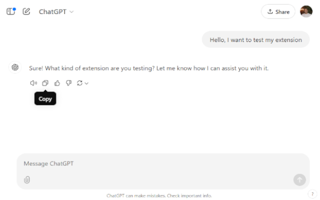

# ChatGPT™ Audio Speed Adjuster

ChatGPT™ Audio Speed Adjuster is a versatile extension designed to give you complete control over the playback speed of audio files directly in your browser. Featuring an easy-to-use interface, customizable speed options, this extension is perfect for improving productivity, enhancing learning, or simply tailoring your listening experience to your needs. Unlock the power of personalized audio playback with **ChatGPT™ Audio Speed Adjuster** and take your audio interactions to the next level!

---

## Screenshots

Enjoy it :blush: